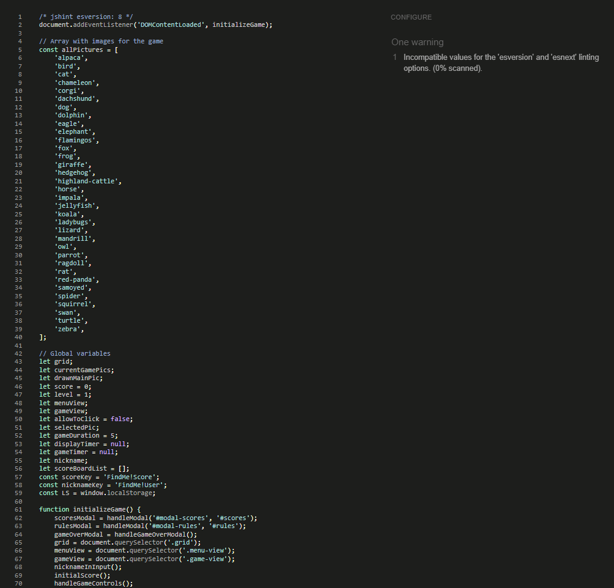

# Find Me! Game

Find Me! Game is memory type of game, I would say it's [Dark Souls](https://www.quora.com/What-makes-the-Dark-Souls-series-so-hard) of the memory games. What makes The Find Me game so hard? There is no place for a mistake and it's time limited. The player has only 5 seconds to remember the board and then have 5 seconds to find a match. There is no winning or loosing per se, but you're earning points for every match and you keep the score on the score list, so you can beat your own score or play local with a friends. The main purpose of the game is to train you memory muscle, and to have fun of course!

View live project [here](https://klaudiamatysiak.github.io/find-me/)

# User Experience (UX)
## User Stories
* First Time Visitors Goals
1. As a First Time Visitor, I want to easly navigate through the game to find content and understand main purpose of it.
2. As a First Time Visitor, I want to start play the game and have fun.
3. As a First Time Visitor, I want to know how much score I've reached.
* Returning Visitors Goals
1. As a Returning Visitors, I want to beat previous scores.
2. As a Returning Visitors, I want to keep training my brain.
3. As a Returning Visitors, I want to have fun.

## Design

## Wireframes

## Updates from original wireframes

# Features
## Main Page
### Logo
### Player's name input
### Menu
## Game Page
## Modals
## Footer

# Technologies Used
* HTML5
* CSS3
* JavaScript
* [Font Awesome](https://fontawesome.com/)
* [Google Fonts](https://fonts.google.com/)
* [Balsamiq](https://balsamiq.com/)

# Testing
## Testing User Stories from User Experience
### First Time Visitor Goals
1. As a First Time Visitor, I want to easly navigate through the game to find content and understand main purpose of it.
- When enter the website for the first time I can easly navigate through the menu. It's clear and intuitive. I can easily find out purpose and rules of the game by clicking "Rules" button.
2. As a First Time Visitor, I want to start play the game and have fun.
- I can easily start the game by giving a nickname and clicking "Start" button. If I forgot put a nickname it comes up alert that I need to do that to start the game. While playing the game I do have fun and my memory is getting better.
3. As a First Time Visitor, I want to know how much score I've reached.
- After each finished game I know how much score I earned.

### Returning Visitors Goals
1. As a Returning Visitors, I want to beat previous scores.
- As I came back later I can try to beat my previous scores, but it's not an easy task.
2. As a Returning Visitors, I want to keep training my brain.
- After several games I'm training my brain. Sometimes it's better, sometimes it's not but I'm keeping up.
3. As a Returning Visitors, I want to have fun.
- I do have a lot of fun!

## HTML
* The [W3C School Validator](https://validator.w3.org/) were used to validate the HTML code on the project.

## CSS
* The [W3C School CSS Validator](https://jigsaw.w3.org/css-validator/validator.html.en) were used to validate CSS code on the project.

## JavaScript
* The [JSHint Validator](https://jshint.com/) were used to validate JS code on the project.

## Lighthouse DevTools

# Credits
## Images
| Link to the image | Name of the Author |
|:---:|:---:|
|[alpaca](https://pixabay.com/photos/alpaca-smile-teeth-fur-funny-farm-985158/)|Richard Smith|
|[bird](https://pixabay.com/photos/bird-robin-spring-flowers-perched-2295436/)|Jill Wellington|
|[cat](https://pixabay.com/photos/cat-bury-cat-brindle-domestic-cat-3062885/)|Daga_Roszkowska|
|[chameleon](https://pixabay.com/photos/chameleon-reptile-lizard-green-540655/)|Frank Winkler|
|[corgi](https://pixabay.com/photos/dog-corgi-cute-animal-4988985/)|Lucio Liu|
|[dachshund](https://pixabay.com/photos/puppy-dog-dachshund-brown-tongue-3698728/)|Lauren Rathbone|
|[dog](https://pixabay.com/photos/beach-puppy-dog-finnishlapphund-1790049/)|Caity|
|[dolphin](https://pixabay.com/photos/dolphin-animal-sea-ocean-203875/)|Claudia Beer|
|[eagle](https://pixabay.com/photos/adler-eagle-bird-white-tailed-eagle-2386314/)|Kathy Büscher|
|[elephant](https://pixabay.com/photos/elephant-watering-hole-baby-elephant-2380009/)|Comfreak|
|[flamingos](https://pixabay.com/photos/flamingo-birds-plumage-sea-water-6126763/)|Marna Buys |
|[fox](https://pixabay.com/photos/animal-fox-cute-sleeping-sleep-967657/)|Shingo_No|
|[frog](https://pixabay.com/photos/frog-butterfly-pond-mirroring-540812/)|Frank Winkler|
|[giraffe](https://pixabay.com/photos/giraffe-animal-facial-expression-614141/)|Christine Sponchia|
|[hedgehog](https://pixabay.com/photos/hedgehog-animal-baby-cute-small-468228/)|Amaya Eguizábal|
|[highland-cattle](https://pixabay.com/photos/bull-cattle-livestock-horns-farm-6726185/)|Artur Pawlak|
|[horse](https://pixabay.com/photos/horse-brown-head-brown-horse-1201143/)|Chiemsee2016|
|[impala](https://pixabay.com/photos/animal-impala-mammal-antelope-6630954/)|Armand Wentzel|
|[jellyfish](https://pixabay.com/photos/jellyfish-underwater-ocean-aquarium-6653502/)|Eddie K|
|[koala](https://pixabay.com/photos/koala-animal-animals-nature-pouch-2914975/)|Annick Vanblaere|
|[ladybugs](https://pixabay.com/photos/ladybugs-insects-pair-1593406/)|Ron van den Berg|
|[lizard](https://pixabay.com/photos/lizard-reptile-animal-creature-653645/)|Foto-RaBe|
|[mandrill](https://pixabay.com/photos/mandrill-animal-monkey-zoo-face-5076687/)|wei zhu|
|[owl](https://pixabay.com/photos/owl-bird-animal-bird-of-prey-50267/)|Chräcker Heller|
|[parrot](https://pixabay.com/photos/parrot-yellow-macaw-bird-perched-3601194/)|IlonaF|
|[ragdoll](https://pixabay.com/photos/ragdoll-cat-pet-animal-6344890/)|京城小坏蛋|
|[rat](https://pixabay.com/photos/rat-pet-eat-440987/)|Jarle Eknes|
|[red-panda](https://pixabay.com/photos/red-panda-bamboo-tongue-out-mammal-1851650/)|Pexels|
|[samoyed](https://pixabay.com/photos/dog-samoyed-run-doggy-cute-spitz-5449489/)|Nikol|
|[spider](https://pixabay.com/photos/spider-zebra-spider-arachnid-564685/)|Inactive account – ID 631372|
|[squirrel](https://pixabay.com/photos/snow-animal-squirrel-rodent-mammal-17854/)|PublicDomainPictures|
|[swan](https://pixabay.com/photos/love-family-swan-family-young-swans-5192377/)|S. Hermann & F. Richter|
|[turtle](https://pixabay.com/photos/sea-turtle-diving-animal-2361247/)|Inactive account – ID 12019|
|[zebra](https://pixabay.com/photos/animal-zebra-wild-wild-life-africa-4917802/)|Alp Cem|

## Design
* [Logo design](https://www.freelogodesign.org/) - Used website to create logo.
* [Coolors](https://coolors.co/) - Used website to present colors palette in README file