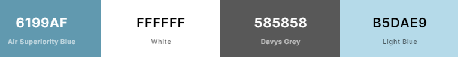
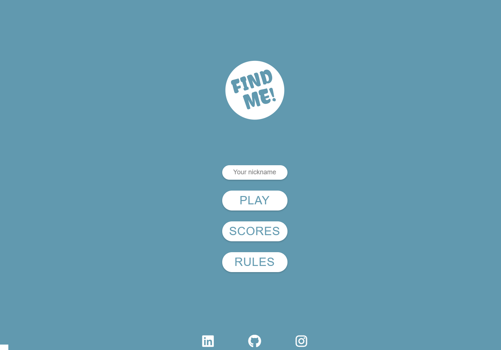

# Find Me! Game

Find Me! Game is memory type of game, I would say it's [Dark Souls](https://www.quora.com/What-makes-the-Dark-Souls-series-so-hard) of the memory games. What makes The Find Me game so hard? There is no place for a mistake and it's time limited. The player has only 5 seconds to remember the board and then have 5 seconds to find a match. There is no winning or loosing per se, but you're earning points for every match and you keep the score on the score list, so you can beat your own score or play local with a friends. The main purpose of the game is to train you memory muscle, and to have fun of course!

View live project [here](https://klaudiamatysiak.github.io/find-me/)

# User Experience (UX)
## User Stories
+ First Time Visitors Goals
    + As a First Time Visitor, I want to easly navigate through the game to find content and understand main purpose of it.
    + As a First Time Visitor, I want to start play the game and have a fun.
    + As a First Time Visitor, I want to know how much score I've reached.
+ Returning Visitors Goals
    + As a Returning Visitors, I want to see previous scores and try to beat it.

## Design

[Direct link to the palette](https://coolors.co/6199af-ffffff-585858-b5dae9)

I've choosen Air Superiority Blue and White colors for main layout colors. Text is either white or Davys Grey depends of the background color. Lighy Blue color is only use for styling score board list.

## Wireframes
I created wireframes in the balsamiq program as first visual concept of the website.
My vision was to have very similar version of the layout game for mobile and desktop view.
Full PDF file with wireframes you can find [here](documentation/files/wireframes.pdf)

Mobile view 

Desktop view 

# Features
## Home Page
Desktop View is very similar to mobile view. Main reason for designing menu in the middle of the screen is to focus user attention on it. It's very simple display, which is why user find it very handy while navigate through it. 

Desktop

Mobile

### Logo
Logo has been created on [FreeLogoDesign](https://www.freelogodesign.org/) website with main colors. The Design is very simple to catch user's eye.

### Player's nickname input
Nickname input has been created to provide player's nickname, then it's saved in Local Storage to read data in order to create Score List. Nickname needs to be inserted to start the game and can not be longer then 12 characters. Once user set their nickname, there is no need to put it again because the input value is set from Local Storage.

### Menu
Navigation menu is clear and simple. User has three option to choose, between starting the game, see score list or read game rules.

---

## Game Page
By click on the PLAY button in menu user see Game Page view. Firstly 9 random pictures appear on the board to remember and the countdown is started. After 5 seconds pictures on the board flipping and main picture on the top is drawn, and user has 5 second to pic the card that user thinks is a matching with main picture.

### Game Header
Game header containes exit icon and text content. Text contain information about player's nickname. It's useful to know which player is playing while there is more than one user playing locally.

### Exit Icon
Exit Icon provides user option to cancel the game and come back to the menu.

### Main Picture
Main Picture that is drawn in the second part of the game has front and back face. The back face is a GIF with three spinning triangles, which gives effect of loading main picture. The front face is drawn picture to find a match on the 9 pictures board.

 

### Game stats - Time and Score
Game stats container has to values, time and score. Firstly appear "Memorize Time" which means that user has to memorize 9 pictures board in this time. Secondly appear "Game Time" which means that user need to find a match in this time.

 

### Pictures Board
Pictures Board contain nine random pictures drawn from 34 piece array.

---

## Modals
Modals are pop up windows that contains valuable information. 

In this project are used to:
- display warnings, which either inform user to enter nickname to start the game or provide correct nickname length.
- display information about the game,
- display information about score list, which can be either empty if user hasn't played yet nor hasn't gain any points, or can contains player's scores in the list. Score list display only 10 highest scores.
- display positive or motivational sentences when the game is over and player's score,

### Warnings Modals

 

### Score List Modal

 

### Rules Modal
Mobile view

Desktop view

### Game Over Modal

---

## Footer
Footer includes Font Awesome Icons that provides social media links to LinkedIn, GitHub and Instagram.

# Technologies Used
+ Languages
    + HTML5
    + CSS3
    + JavaScript
* [Font Awesome](https://fontawesome.com/) - The icons for social media, points for rules and exit arrow were taken from Font Awesome.
* [favicon](favicon.io) - Favicon was used to create site's favicon.
* [Google Fonts](https://fonts.google.com/) - The font was imported from Google Fonts. This site uses 'Montserrat' font.
* [CSS root variables](https://css-tricks.com/breaking-css-custom-properties-out-of-root-might-be-a-good-idea/) - CSS root variables was used to store global styling in it.
* [Flex Box](https://css-tricks.com/snippets/css/a-guide-to-flexbox/) - Flex Box was used throuout web page to style all elements and keep responsivnes at the same time.
* [Custom List Numbers](https://css-tricks.com/custom-list-number-styling/) - Custom List Number styling was used to make creative styling for score list.
* [JavaScript Local Storage ](https://blog.logrocket.com/localstorage-javascript-complete-guide/) - Local Storage was used to save player's nickname and player's score, and read data to create score list.
* [Balsamiq](https://balsamiq.com/) - Balsamiq was used to make Desktop and Mobile Wireframes.
* [Git](https://git-scm.com/) - Git was used for version control and saving work in the repository, using the GitPod extension in Google Chrome to commit to GitHub.
* [Am I Responsive?](http://ami.responsivedesign.is/#) - Website used to create mockup image for this README file.
* [Autoprefixer](https://autoprefixer.github.io/) - Autoprefixer was used to add necessary prefixes to ensure site styling remains consistent.

# Testing
* The testing section is in a separate file, [here](TESTING.md).

# Deployment

## Github Pages
The site was deployed to GitHub pages. The steps to deploy are as follows: 
  - In the [GitHub repository](https://github.com/KlaudiaMatysiak/find-me), navigate to the Settings tab 
  - From the source section drop-down menu, select the **Main** Branch, then click "Save".
  - The page will be automatically refreshed with a detailed ribbon display to indicate the successful deployment.

The live link can be found [here](https://klaudiamatysiak.github.io/find-me)

### Local Deployment

In order to make a local copy of this project, you can clone it. In your IDE Terminal, type the following command to clone my repository:

- `git clone https://github.com/KlaudiaMatysiak/find-me.git`

Alternatively, if using Gitpod, you can click below to create your own workspace using this repository.

## The Web Storage API - Local Storage
The Web Storage API provides mechanisms by which browsers can store key/value pairs. Used the Web Storage mechanism is Local Storage to save and read data that is used on the page. User does not need to take any action to have it, as it's build-in function in web browser.

# Credits
## Images
| Link to the image | Name of the Author |
|:---:|:---:|
|[alpaca](https://pixabay.com/photos/alpaca-smile-teeth-fur-funny-farm-985158/)|Richard Smith|
|[bird](https://pixabay.com/photos/bird-robin-spring-flowers-perched-2295436/)|Jill Wellington|
|[cat](https://pixabay.com/photos/cat-bury-cat-brindle-domestic-cat-3062885/)|Daga_Roszkowska|
|[chameleon](https://pixabay.com/photos/chameleon-reptile-lizard-green-540655/)|Frank Winkler|
|[corgi](https://pixabay.com/photos/dog-corgi-cute-animal-4988985/)|Lucio Liu|
|[dachshund](https://pixabay.com/photos/puppy-dog-dachshund-brown-tongue-3698728/)|Lauren Rathbone|
|[dog](https://pixabay.com/photos/beach-puppy-dog-finnishlapphund-1790049/)|Caity|
|[dolphin](https://pixabay.com/photos/dolphin-animal-sea-ocean-203875/)|Claudia Beer|
|[eagle](https://pixabay.com/photos/adler-eagle-bird-white-tailed-eagle-2386314/)|Kathy Büscher|
|[elephant](https://pixabay.com/photos/elephant-watering-hole-baby-elephant-2380009/)|Comfreak|
|[flamingos](https://pixabay.com/photos/flamingo-birds-plumage-sea-water-6126763/)|Marna Buys |
|[fox](https://pixabay.com/photos/animal-fox-cute-sleeping-sleep-967657/)|Shingo_No|
|[frog](https://pixabay.com/photos/frog-butterfly-pond-mirroring-540812/)|Frank Winkler|
|[giraffe](https://pixabay.com/photos/giraffe-animal-facial-expression-614141/)|Christine Sponchia|
|[hedgehog](https://pixabay.com/photos/hedgehog-animal-baby-cute-small-468228/)|Amaya Eguizábal|
|[highland-cattle](https://pixabay.com/photos/bull-cattle-livestock-horns-farm-6726185/)|Artur Pawlak|
|[horse](https://pixabay.com/photos/horse-brown-head-brown-horse-1201143/)|Chiemsee2016|
|[impala](https://pixabay.com/photos/animal-impala-mammal-antelope-6630954/)|Armand Wentzel|
|[jellyfish](https://pixabay.com/photos/jellyfish-underwater-ocean-aquarium-6653502/)|Eddie K|
|[koala](https://pixabay.com/photos/koala-animal-animals-nature-pouch-2914975/)|Annick Vanblaere|
|[ladybugs](https://pixabay.com/photos/ladybugs-insects-pair-1593406/)|Ron van den Berg|
|[lizard](https://pixabay.com/photos/lizard-reptile-animal-creature-653645/)|Foto-RaBe|
|[mandrill](https://pixabay.com/photos/mandrill-animal-monkey-zoo-face-5076687/)|wei zhu|
|[owl](https://pixabay.com/photos/owl-bird-animal-bird-of-prey-50267/)|Chräcker Heller|
|[parrot](https://pixabay.com/photos/parrot-yellow-macaw-bird-perched-3601194/)|IlonaF|
|[ragdoll](https://pixabay.com/photos/ragdoll-cat-pet-animal-6344890/)|京城小坏蛋|
|[rat](https://pixabay.com/photos/rat-pet-eat-440987/)|Jarle Eknes|
|[red-panda](https://pixabay.com/photos/red-panda-bamboo-tongue-out-mammal-1851650/)|Pexels|
|[samoyed](https://pixabay.com/photos/dog-samoyed-run-doggy-cute-spitz-5449489/)|Nikol|
|[spider](https://pixabay.com/photos/spider-zebra-spider-arachnid-564685/)|Inactive account – ID 631372|
|[squirrel](https://pixabay.com/photos/snow-animal-squirrel-rodent-mammal-17854/)|PublicDomainPictures|
|[swan](https://pixabay.com/photos/love-family-swan-family-young-swans-5192377/)|S. Hermann & F. Richter|
|[turtle](https://pixabay.com/photos/sea-turtle-diving-animal-2361247/)|Inactive account – ID 12019|
|[zebra](https://pixabay.com/photos/animal-zebra-wild-wild-life-africa-4917802/)|Alp Cem|

## Design
* [Logo design](https://www.freelogodesign.org/) - Used website to create logo.
* [Coolors](https://coolors.co/) - Used website to present colors palette in README file

## Other
I've read several articles, blogs, and posts/messages between developers about that helped me: 
* Dataset in Javascript -  [link](https://medium.com/@adamkearney124/using-dataset-in-javascript-5331af3ec6c3), [link](https://xcatherine-jimenez.medium.com/using-dataset-in-javascript-4bfa2d657590), [link](https://www.thewebdeveloperguide.com/javascript-get-data-attribute/).
* Local Storage - [link](https://www.javascripttutorial.net/web-apis/javascript-localstorage/), [link](https://www.kirupa.com/html5/storing_and_retrieving_an_array_from_local_storage.htm), [link](https://blog.logrocket.com/localstorage-javascript-complete-guide/).
* Promises - [link](https://developer.mozilla.org/en-US/docs/Web/JavaScript/Guide/Using_promises), [link](https://www.30secondsofcode.org/articles/s/javascript-await-timeout)