# Testing
## Devices
+ The project was tested on: 
    + Desktop: 
        + Google Chrome,

            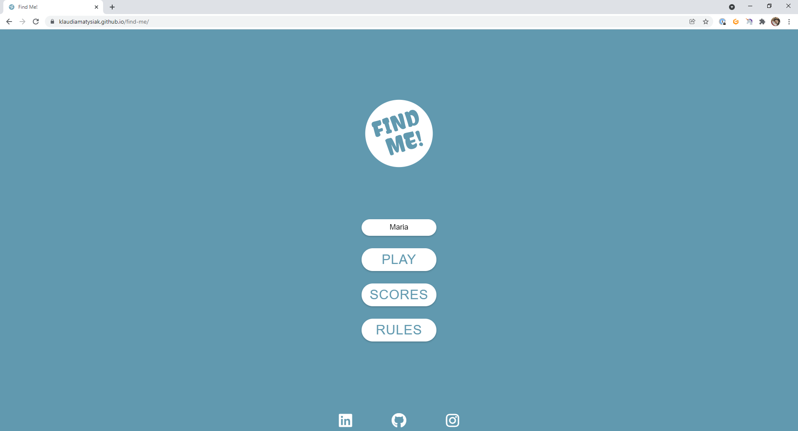
            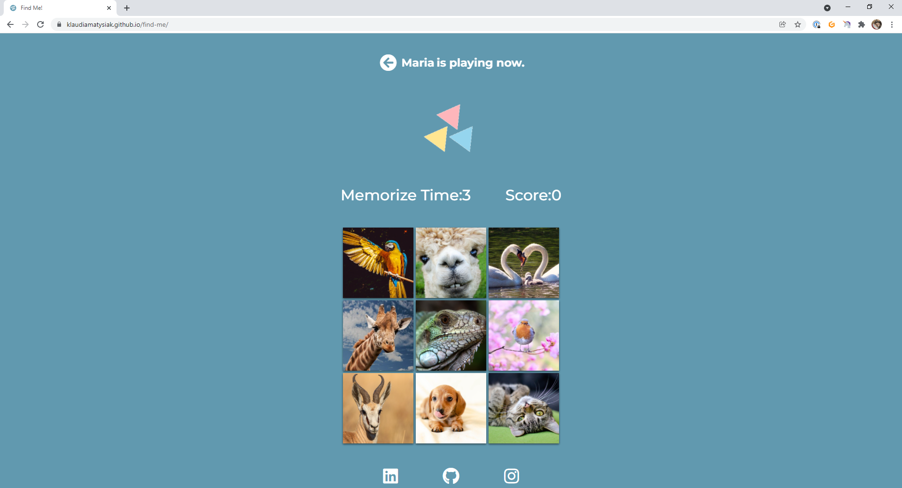

        + Edge,

            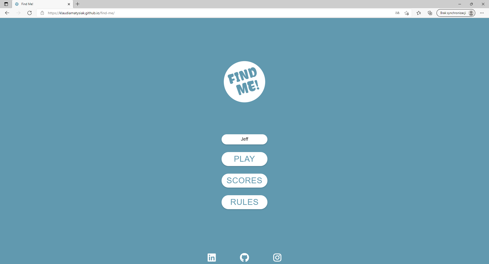
            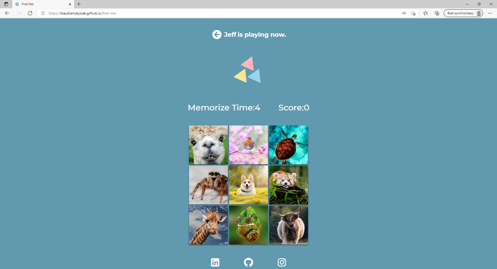

    + Mobile:
        + iPhone 12 Pro

            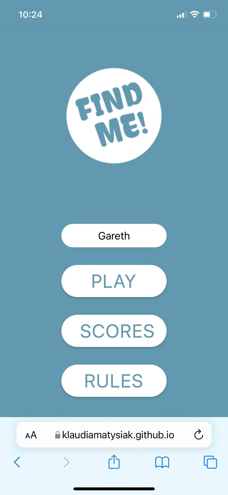
            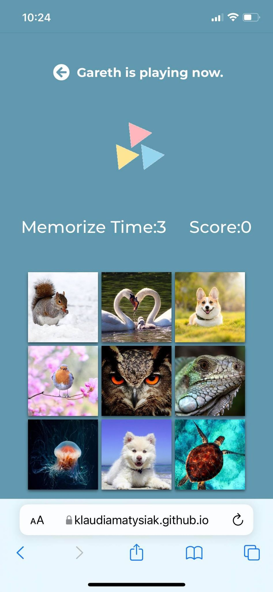

    + Tablet:
        + Samsung Galaxy Tab III

            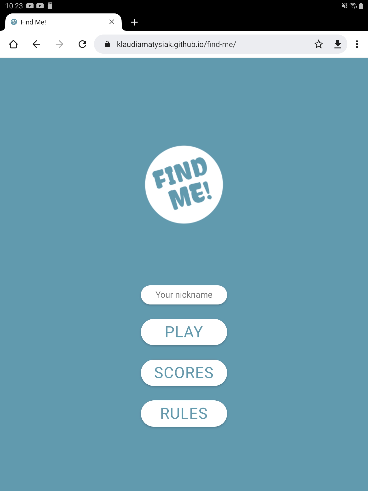
            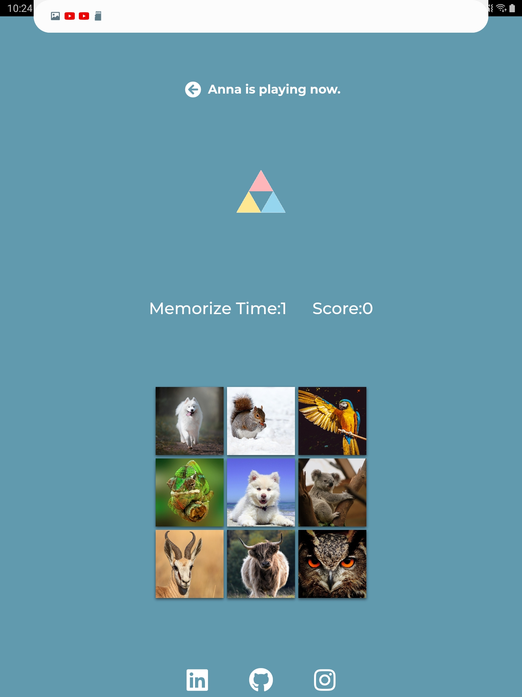

## Testing User Stories 

### First Time Visitor Goals
+ As a First Time Visitor, I want to easly navigate through the game to find content and understand main purpose of it.
    + When enter the website for the first time I can easly navigate through the menu. It's clear and intuitive. I can easily find out purpose and rules of the game by clicking "Rules" button, or check score list by clicking "Scores" button.

        

+ As a First Time Visitor, I want to start play the game and have fun.
    + I can easily start the game by giving a nickname and clicking "Start" button. 

        

    + If I forgot put a nickname it comes up modal with information that I need to provide nickname to start the game. 

        

    + If I add to much spacing in nickname input it does not pass it into Local Storage, as I used trim function to avoid unnecessary spacing.

        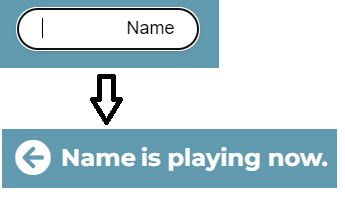

    + if I add too long nickname it comes up modal with information that Nickname can not be longer than 12 characters.

        

    + While playing the game I do have fun and my memory is getting better.

+ As a First Time Visitor, I want to know how much score I've reached.
    + After each finished game I know how much score I earned.

        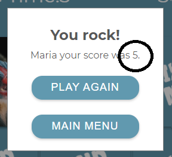

    + While coming back to main menu I can check score list, the maximum capacity of score list has been achived.

        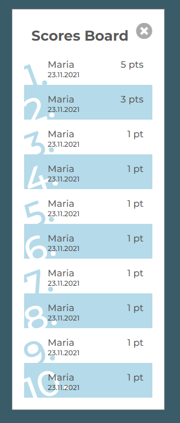

### Returning Visitors Goals
+ As a Returning Visitors, I want to see previous scores and try to beat it.
    + As I came back later I can try to beat my previous scores, but it's not an easy task.

        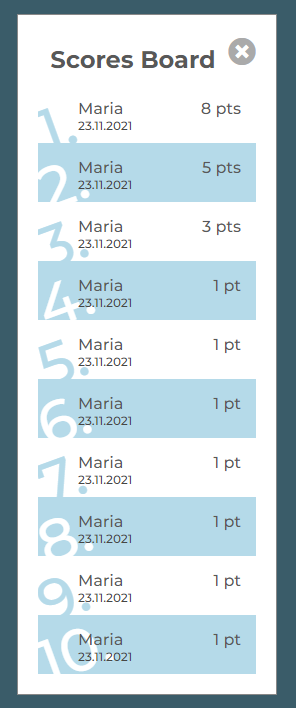

## Manual Testing (Added features after first Testing)
+ Show correct answer
    + After chosing wrong picture as user I wanted to know where was the correct one.

        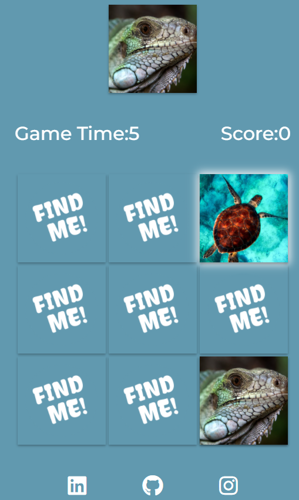

    + When timer was up I wanted to know where was correct one.

        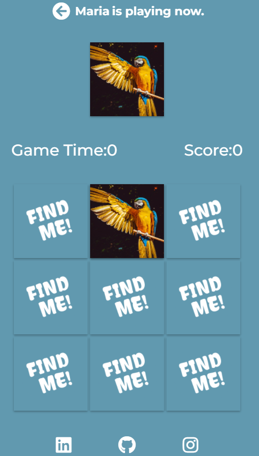

+ Clicked picture by player
    + As I added correct picture showing after game is over, there was some illusion that user chose correct answer and the game was finished. 
    + So when user clicked correct answer while time showed 0, the correct answer appeard after user clicked at this picture, but in reality user couldn't click it as when the time is up user is not allowed to click it.
    + For clear visualisation I added white shadow box for picture that user actually clicked in the game time.

        

+ Exit Icon
    + During testing sometimes I missed click buttons. Many times I clicked play but I didn't want to and there was no option on the game view of coming back then waiting 10 seconds for game to finish.
    + So I created Exit Icon in the game header that reset the game and getting user to the menu view.

        


## Code Validation
### HTML
+ [First input](documentation/images/error-html.png) to HTML Validator had couple errors:
    + Alt and src attributes were empty.
    + In game section was missing header.
    + In modal was h1 used.
+ I fixed all errors.

* The [W3C School Validator](https://validator.w3.org/) were used to validate the HTML code on the project.

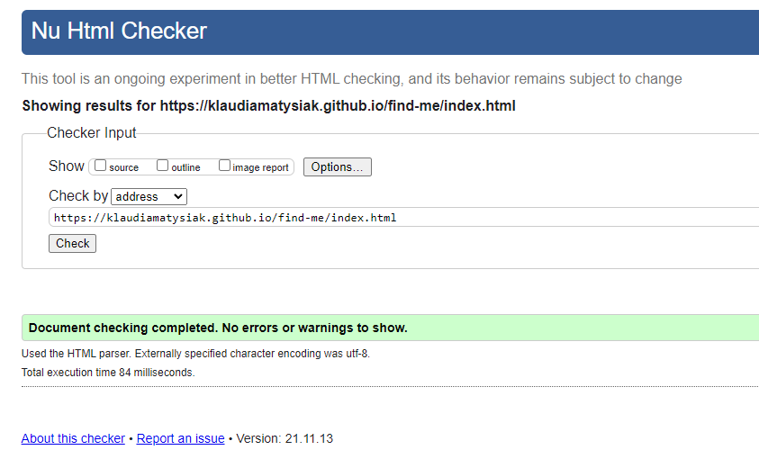

### CSS
* The [W3C School CSS Validator](https://jigsaw.w3.org/css-validator/validator.html.en) were used to validate CSS code on the project.


### JavaScript
* The [JSHint Validator](https://jshint.com/) were used to validate JS code on the project.

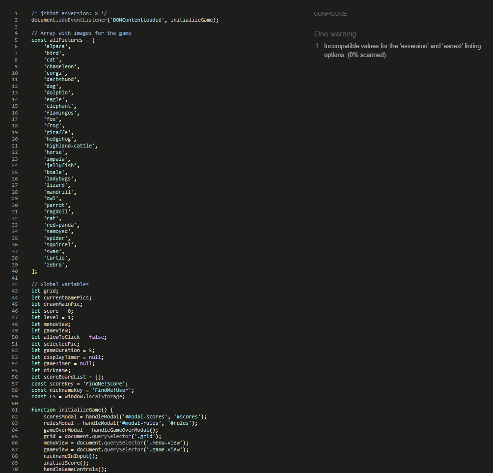

## Lighthouse DevTools
+ First Lighthouse Report had 90 points in SEO so to improve that I've added meta discription in index.html file. 

    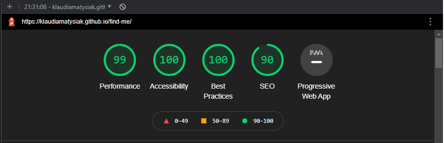

- Second Lighthouse Report had 97 points in performence so to improve it I deleted unused font weights from CSS @import element. I forgot to screenshot it.

+ Third Lighthouse Report had 99 points in performence so to improve it I change the way of import font from google fonts.

    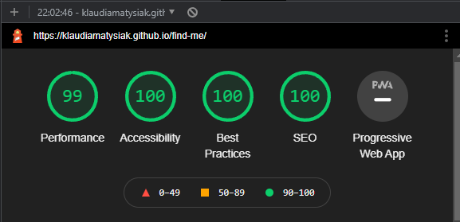

+ Fourth Lighthouse Report

    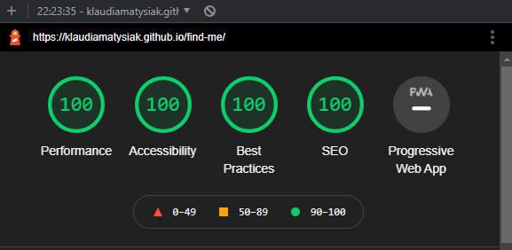

## Bug 
+ Apple devices had problem with correct displaying pictures on the board.

    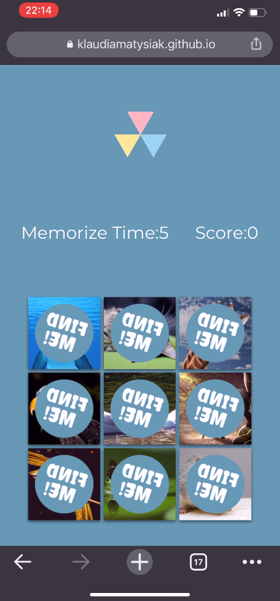

    + To fix it I used [autoprefixer](https://autoprefixer.github.io/) that helped with displaying front of the picture.
        ```
        .card .card-front {
            -webkit-transform: rotateY(180deg);
                    transform: rotateY(180deg);
            -webkit-backface-visibility: hidden;
                    backface-visibility: hidden;
        }
        ```

    + To fix display animation of flipping pictures I've added z-axis in 3D space. I used Layers tools in Chrome Dev Tools.
        ```
        .card .card-back {
            transform: translateZ(1px);
        }
        ```
