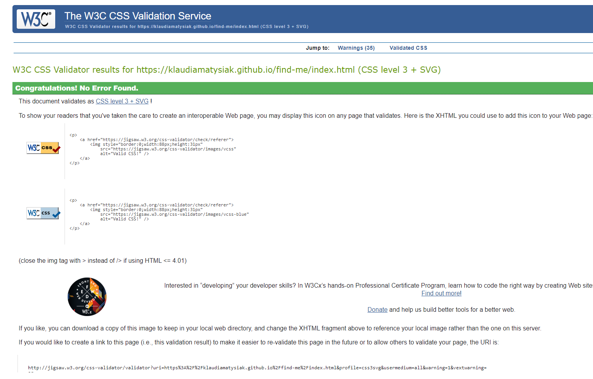

# Testing
## Testing User Stories from User Experience
### First Time Visitor Goals
1. As a First Time Visitor, I want to easly navigate through the game to find content and understand main purpose of it.
- When enter the website for the first time I can easly navigate through the menu. It's clear and intuitive. I can easily find out purpose and rules of the game by clicking "Rules" button.
2. As a First Time Visitor, I want to start play the game and have fun.
- I can easily start the game by giving a nickname and clicking "Start" button. If I forgot put a nickname it comes up alert that I need to do that to start the game. While playing the game I do have fun and my memory is getting better.
3. As a First Time Visitor, I want to know how much score I've reached.
- After each finished game I know how much score I earned.

### Returning Visitors Goals
1. As a Returning Visitors, I want to beat previous scores.
- As I came back later I can try to beat my previous scores, but it's not an easy task.
2. As a Returning Visitors, I want to keep training my brain.
- After several games I'm training my brain. Sometimes it's better, sometimes it's not but I'm keeping up.
3. As a Returning Visitors, I want to have fun.
- I do have a lot of fun!

## HTML
* The [W3C School Validator](https://validator.w3.org/) were used to validate the HTML code on the project.

## CSS
* The [W3C School CSS Validator](https://jigsaw.w3.org/css-validator/validator.html.en) were used to validate CSS code on the project.

## JavaScript
* The [JSHint Validator](https://jshint.com/) were used to validate JS code on the project.

## Lighthouse DevTools
