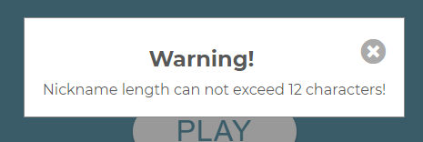

# Testing
## Testing User Stories from User Experience
### First Time Visitor Goals
+ As a First Time Visitor, I want to easly navigate through the game to find content and understand main purpose of it.
    + When enter the website for the first time I can easly navigate through the menu. It's clear and intuitive. I can easily find out purpose and rules of the game by clicking "Rules" button, or check score list by clicking "Scores" button.

        

+ As a First Time Visitor, I want to start play the game and have fun.
    + I can easily start the game by giving a nickname and clicking "Start" button. 

        

    + If I forgot put a nickname it comes up modal with information that I need to provide nickname to start the game. 

        

    + If I add to much spacing in nickname input it does not pass it into Local Storage, as I used trim function to avoid unnecessary spacing.

        

    + if I add too long nickname it comes up modal with information that Nickname can not be longer than 12 characters.

        

    + While playing the game I do have fun and my memory is getting better.

+ As a First Time Visitor, I want to know how much score I've reached.
    + After each finished game I know how much score I earned.

        

    + While coming back to main menu I can check score list, the maximum capacity of score list has been achived.

        

### Returning Visitors Goals
+ As a Returning Visitors, I want to see previous scores and try to beat it.
    + As I came back later I can try to beat my previous scores, but it's not an easy task.
    
        

## HTML
* The [W3C School Validator](https://validator.w3.org/) were used to validate the HTML code on the project.

## CSS
* The [W3C School CSS Validator](https://jigsaw.w3.org/css-validator/validator.html.en) were used to validate CSS code on the project.

## JavaScript
* The [JSHint Validator](https://jshint.com/) were used to validate JS code on the project.

## Lighthouse DevTools
